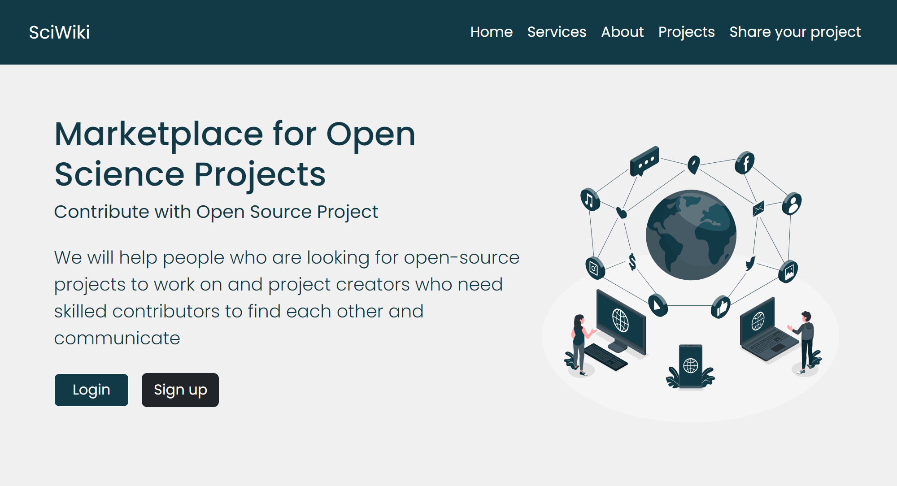
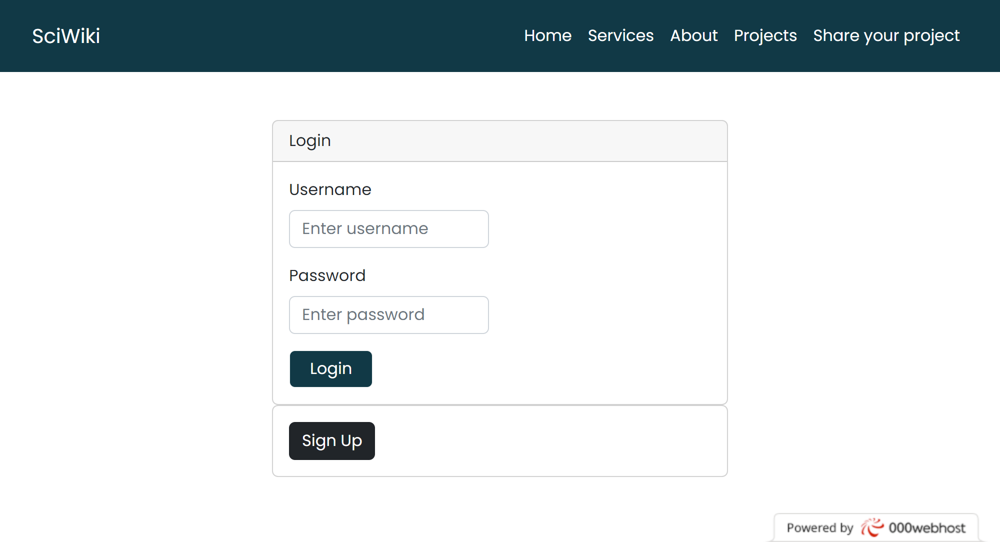
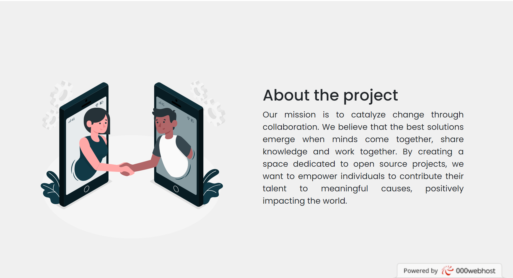
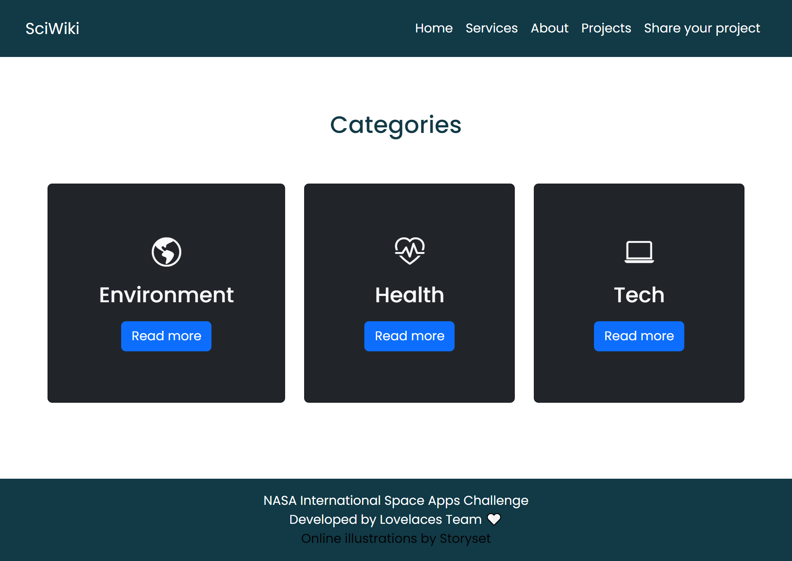
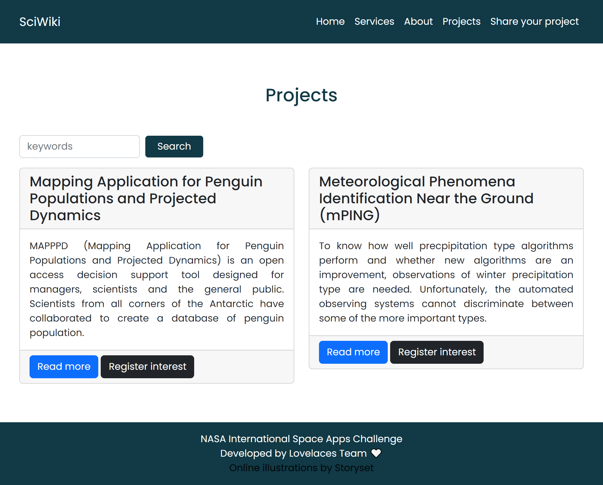

# SciWiki

## NASA Space Apps 2023 - A Marketplace for Open Science Projects

### HIGH-LEVEL SUMMARY
We developed an open source tool that provides people an easier way to find open source and open science projects around the internet, which involve many areas of knowledge. We provide people to share their own projects and also find projects to work. The project creators can share what habilities they are looking for in people, and project colaborators can share their own habilities. People can register as project creator or colaborator, but they dont need to log in the platform to navigate in the tool. Its a non-profit market place web platform. It's provide people who belongs to different areas to connect with eachother, our platform contains projects open source from NASA, the government and people who want to share as well, we believe that if we connect people from different areas and offer an easier way to work on projects and study we can increase their interest in science.

### PROJECT DETAILS
We developed a non-profit marketplace web platform that provides people an easier way to find open-source and open-science projects around the internet, which involve many areas of knowledge. We provide people to share their own projects and also find projects to work.

People can decide if they want to log or register in the platform or not, they can navigate anyway. But if they decide to register, they can register as a project creator or a colaborator. If they register as a colaborator they can share their habilities and register interest in projects. If they register as a creator, they can submit a project and share the habilities they are looking for, but this doesn't stop the creator to show interest in a project because they all can navigate in datas provided by NASA and other institutions that provides open-source projects.

We offer an easier way to people to connect with eachother, its a free and multidisciplinary tool.

We believe that if we connect people from different areas and offer an easier way to work on projects and study we can increase their interest in science.

### USE OF ARTIFICIAL INTELLIGENCE
GPT-3 was used to generate the texts seen on the pages.

### SPACE AGENCY DATA
[NASA Open Source Science Initiative](https://science.nasa.gov/researchers/open-science/) 
[Citizen Science](https://www.citizenscience.gov/#) 
[National Geodetic Survey](https://geodesy.noaa.gov/GPSonBM/) 
[Zooniverse](https://www.zooniverse.org/projects/ucla-seti-group/are-we-alone-in-the-universe) 

### REFERENCES
[Bootstrap](https://getbootstrap.com/) 
[Storyset](https://storyset.com/) 
[GPT-3](https://chat.openai.com/) 

### PROJECT PRESENTATION
You can access our website by clicking [here](https://sciwiki.000webhostapp.com/index.php) or [here](https://sciwiki.janinedede.repl.co/) 

 
 
 
 
 

Made with ♡ by the lovelaces team. 
Members:
[Bárbara Hellen](https://github.com/barbarahellen),
[Janine de França](https://github.com/janinefr),
[Luana Chacon](https://github.com/lmcca),
[Maria Eduarda](https://github.com/EduardaBezerra).

